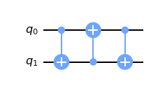
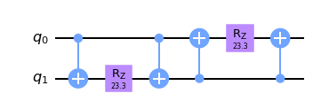

### 量子门分解
#### 用 CNOT 门实现 SWAP 门

如果已知可以不用辅助位只用控制非门实现交换门，那么可以做如下考量：线路上仅能执行两种控制非门，而连续执行两个相同的控制非门没有任何意义，所以相邻两个控制非门的控制位与目标位一定分别不同。又两位地位相同，因而可以模拟单一过程直到发现执行了交换门，并发现为 3 次。

实际上 OI 中存在一种交换两数 `std::enable_if_t<std::is_unsigned_v<T>, T> a, b;` 的方法 `a ^= b ^= a ^= b`，分解到每一位上实际上就是这个过程（控制非门对应于异或赋值）。

```python
c = tc.Circuit(2)

c.cnot(0, 1)
c.cnot(1, 0)
c.cnot(0, 1)

d = tc.Circuit(2)
d.swap(0, 1)

print(np.allclose(c.matrix(), d.matrix()))
c.draw(output='mpl')
```



#### 用 CNOT 门和 Rz 门实现 Rzz 门

$$
\begin{aligned}
R_z(\theta)&=\exp\left(-i\theta/2\hat Z\right).\\
R_{zz}(\theta)&=\exp\left(-i\theta/2\hat Z\otimes\hat Z\right).
\end{aligned}
$$

简单计算知

$$
\hat Z\otimes\hat Z=\begin{pmatrix}
1&0&0&0\\
0&-1&0&0\\
0&0&-1&0\\
0&0&0&1
\end{pmatrix}.
$$

感性理解，$|00\rangle,|11\rangle$ 对应一位的 $|0\rangle$，$|01\rangle,|10\rangle$ 对应 $|1\rangle$，这可以通过控制非做到。

```python
c = tc.Circuit(2)

theta = float(input())

c.cnot(0, 1)
c.rz(1, theta = theta)
c.cnot(0, 1)
c.cnot(1, 0)
c.rz(0, theta = theta)
c.cnot(1, 0)

d = tc.Circuit(2)
d.rzz(0, 1, theta=theta)

print(np.allclose(c.matrix(), d.matrix()))
c.draw(output='mpl')
```



容易计算验证。

### 线路解释

考虑以下代码实现的线路及测量的得到的结果。

```python
def hmtest(s, u):
    np.testing.assert_allclose(
        np.conj(u) @ np.transpose(u), np.eye(u.shape[-1]), atol=1e-6
    )
    input_state = np.kron(np.array([1, 0]), s)
    n = int(np.log(s.shape[-1]) / np.log(2))
    c = tc.Circuit(n + 1, inputs=input_state)
    c.H(0)
    c.multicontrol(*range(n + 1), ctrl=[1], unitary=u)
    c.H(0)
    return c.expectation_ps(z=[0])


hmtest(
    np.array([1.0, 0, 0, 0]),
    np.kron(np.array([[1.0, 0], [0, -1]]), np.array([[1.0, 0], [0, -1]])),
)
```

理解线路图，其实际上计算的是 $v^{\mathsf T}\hat Zv$，其中

$$
v=\frac12
\begin{pmatrix}
I&I\\
I&-I\\
\end{pmatrix}
\begin{pmatrix}
I&0\\
0&U\\
\end{pmatrix}
\begin{pmatrix}
I&I\\
I&-I\\
\end{pmatrix}
\begin{pmatrix}
S\\
0
\end{pmatrix}=\frac12
\begin{pmatrix}
S+US\\
S-US
\end{pmatrix}.
$$

即测量 $\hat Z$ 关于 $\displaystyle\frac12
\begin{pmatrix}
S+US\\
S-US
\end{pmatrix}$ 的期望。